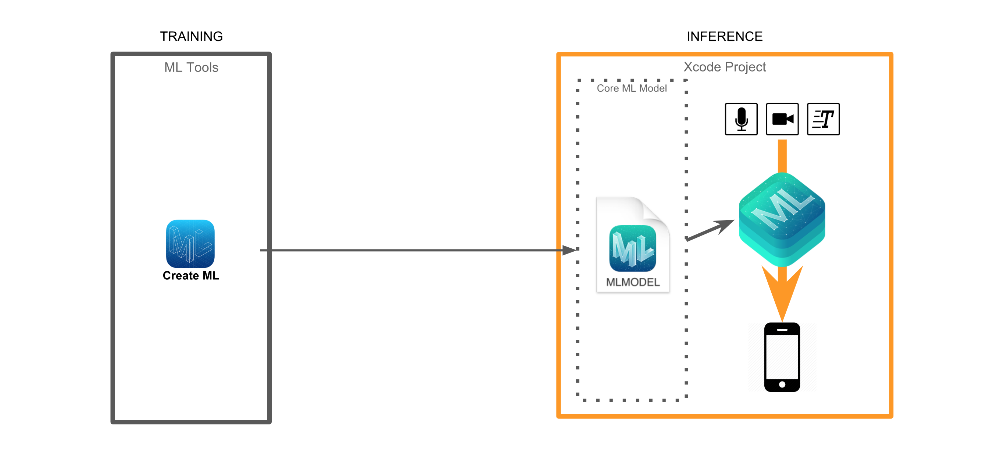
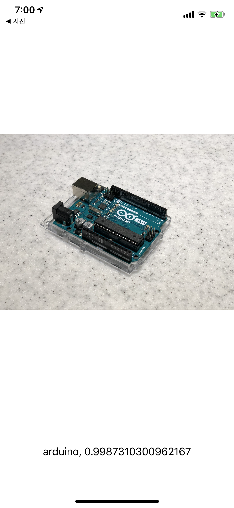

We tackle the challenge of using machine learning models created from TensorFlow on iOS via Core ML and ML Kit (TensorFlow Lite).

[한국어 README](https://github.com/motlabs/iOS-Proejcts-with-ML-Models/blob/master/README_kr.md)

## Machine Learning Framework for iOS

- [Core ML](https://developer.apple.com/documentation/coreml)
- [ML Kit](https://developers.google.com/ml-kit/)
- etc. ([Tensorflow Lite](https://www.tensorflow.org/mobile/tflite/), [Tensorflow Mobile](https://www.tensorflow.org/mobile/))

### Flow of Model When Using Core ML

The overall flow is very similar for most ML frameworks. Each framework has its own compatible model format. We need to take the model created in TensorFlow and **convert it into the appropriate format, for each mobile ML framework**.

Once the compatible model is prepared, you can run the inference using the ML framework. Note that you must perform **pre/postprocessing** manually.

> If you want more explanation, check [this slide(Korean)](https://docs.google.com/presentation/d/1wA_PAjllpLLcFPuZcERYbQlPe1Ipb-bzIZinZg3zXkg/edit?usp=sharing).

### Flow of Model When Using Create ML

## Example Projects Using Various Machine Learning Models

#### DONE

- Using built-in model with Core ML

- Using built-in on-device model with ML Kit
- Using custom model for Vision with Core ML and ML Kit

#### TODO

- Object Detection with Core ML and ML Kit
- Using built-in cloud model on ML Kit
  - Landmark recognition
- Using custom model for NLP with Core ML and ML Kit
- Using custom model for Audio with Core ML and ML Kit
  - Audio recognition
  - Speech recognition
  - TTS

### 1. MobileNet

Example project using MobileNet model.

1. [MobileNet-CoreML](https://github.com/tucan9389/MobileNetApp-CoreML)
2. [MobileNet-MLKit](https://github.com/tucan9389/MobileNetApp-MLKit)

|                    MobileNet with Core ML                    |                    MobileNet with ML Kit                     |
| :----------------------------------------------------------: | :----------------------------------------------------------: |
|  |  |

### 2. Pose Estimation

1. [PoseEstimation-CoreML](https://github.com/tucan9389/PoseEstimation-CoreML)
2. [PoseEstimation-MLKit](https://github.com/tucan9389/PoseEstimation-MLKit)
3. [dont-be-turtle-ios](https://github.com/motlabs/dont-be-turtle-ios)
4. [FingertipEstimation-CoreML](https://github.com/tucan9389/FingertipEstimation-CoreML)

- [KeypointAnnotation](https://github.com/tucan9389/KeypointAnnotation) 
  : Annotation tool for own custom estimation dataset

#### Modules Used

- `Measure.swift`
- `PoseView.swift`
- `HeatmapView.swift`

#### 2.1 Pose Estimation

|                    PoseEstimation-CoreML                     |                     PoseEstimation-MLKit                     |
| :----------------------------------------------------------: | :----------------------------------------------------------: |
|  |  |

| dont-be-turtle-ios                                           |
| ------------------------------------------------------------ |
|  |

#### 2.2 Fingertip Estimation

| FingertipEstimation-CoreML                                   | KeypointAnnotation                                           |
| ------------------------------------------------------------ | ------------------------------------------------------------ |
|  |  |

### 3. Object Detection

1. [SSDMobileNet-CoreML](https://github.com/tucan9389/SSDMobileNet-CoreML) : Detect 90 objects(find the object box of position and size and identify the category).

| SSDMobileNet-CoreML |
| ------------------- |
| (DEMO preparing...) |

### 4. Text Detection & Recognition

1. [WordRecognition-CoreML-MLKit](https://github.com/tucan9389/WordRecognition-CoreML-MLKit)(preparing...) 
   :  Detect character, find a word what I point and then recognize the word using Core ML and ML Kit.
2. WordRecognition-MLKit(preparing...) 
   : Just recognize words by using MLKit's text recognition function.

|                 WordRecognition-CoreML-MLKit                 | WordRecognition-MLKit |
| :----------------------------------------------------------: | :-------------------: |
|  |  (DEMO preparing...)  |

### 5. A Simple Classification Using Create ML and Core ML

1. [SimpleClassification-CreateML-CoreML](https://github.com/tucan9389/SimpleClassification-CreateML-CoreML)

| Create ML                                                    | Core ML                            |
| ------------------------------------------------------------ | ---------------------------------- |
|  |  |

## Module of Performance Measurement

### 1. Inference Duration, Excution Duration and FPS Evaluation Module (preparing...)

> This function is implemented(`Measure.swift`) in [PoseEstimation-CoreML](https://github.com/tucan9389/PoseEstimation-CoreML), but need to modulization.

### 2. Evalutation Project (preparing...)

#### 2-1. Unit Test

> Show output for each input?
> Drawing detail of result?
> Test for debugging?
>
> - Pose Estimation: draw dot each point and joint, print confidence each point.
> - ...

#### 2-2. Bunch Test (planning...)

> Analyze outputs from a bunch of inputs
>
> - average of inference time and fps
> - accumulate execution time, fps...?
> - rendering time
> - total execution time
> - ...

## Author

- [tucan9389](https://github.com/tucan9389)

## See also

- [Core ML | Apple Developer Documentation](https://developer.apple.com/documentation/coreml)
- [Machine Learning - Apple Developer](https://developer.apple.com/machine-learning/)
- WWDC17 - Core ML 발표자료
  - [WWDC17 703 Session - Introducing Core ML](https://developer.apple.com/videos/play/wwdc2017/703/)
  - [WWDC17 710 Session - Core ML in depth](https://developer.apple.com/videos/play/wwdc2017/710/)
  - [WWDC17 506 Session - Vision Framework: Building on Core ML](https://developer.apple.com/videos/play/wwdc2017/506)
- WWDC18 - Core ML 2 발표자료
  - [WWDC18 708 Session - What’s New in Core ML, Part 1](https://developer.apple.com/videos/play/wwdc2018/708/)
  - [WWDC18 709 Session - What’s New in Core ML, Part 2](https://developer.apple.com/videos/play/wwdc2018/709/)
  - [WWDC18 717 Session - Vision with Core ML](https://developer.apple.com/videos/play/wwdc2018/717/)
- [ML Kit - Firebase](https://developers.google.com/ml-kit/)
- [Apple's Core ML 2 vs. Google's ML Kit: What's the difference?](https://venturebeat.com/2018/06/05/apples-core-ml-2-vs-googles-ml-kit-whats-the-difference/)
- [iOS에서 머신러닝 슬라이드 자료](https://docs.google.com/presentation/d/1wA_PAjllpLLcFPuZcERYbQlPe1Ipb-bzIZinZg3zXkg/edit?usp=sharing)
- [MoTLabs Blog](https://motlabs.github.io/)
